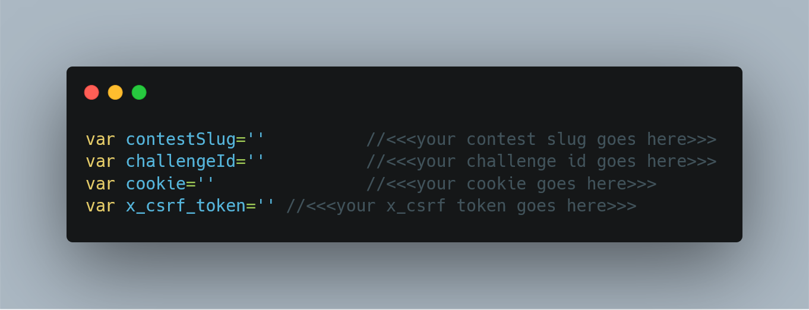

# Hackerrank Scraper Tool for contest creators
Hackerrank scraper is a simple tool written in node js to scrap the code submitted during a contest. This tool is meant for contest creators who want to download the submitted code and run plagiarism test on the code.

# Steps to reproduce
- Download the repo to the folder where you want to download the submitted code.
- Login to your hackerrank account and copy the **cookie** and **X-CSRF-Token** from the browser dev tools. I will be there in the network tab.
- Place the **cookie** and **X-CSRF-Token** obtained in the code. There are separate variables to store these values.
- You can obtain the contest slug from the manage contests tab.
- Each challenge in your contest will have a challenge slug, copy that to the code.
- Run ```npm install```. This will install all the required dependencies.
- Finally run ```node scraper.js```



     
#### Note: The **cookie** and **X-CSRF-Token** are used for authentication ####
